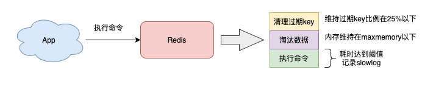
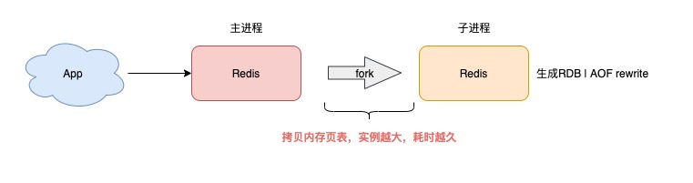
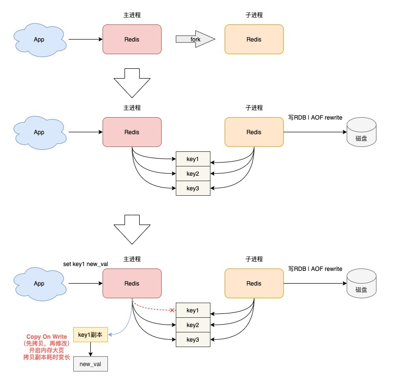
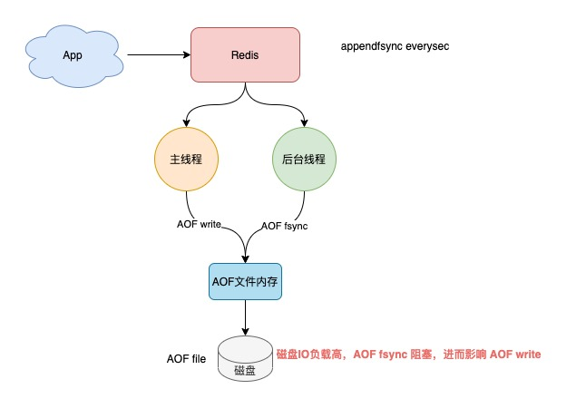

Redis作为内存数据库，具有非常高的性能，单个实例的OPS能够达到10W左右。

## 确认是否Redis本身响应慢

如果你发现你的业务服务API响应延迟变长，首先你需要先排查服务内部，究竟是哪个环境拖慢了整个服务。比较高效的做法是在服务内部集成链路追踪。

如果发现确实是操作Redis的这条链路耗时变长了，那么此刻需要把焦点关注在业务服务到Redis这条链路上。

从你的业务服务到Redis这条链路变慢的原因可能也有2个：

- 业务服务器到Redis服务器之间的网络存在问题，例如网络线路质量不佳，网络数据包在传输时存在延迟、丢包等情况。
- Redis本身存在问题，需要进一步排查是什么原因导致Redis变慢。


## Redis基准性能测试

从Redis角度来排查，是否存在导致变慢的场景，以及都有哪些因素会导致Redis的延迟增加，然后针对性的进行优化。

排除网络原因，确认你的Redis是否真的变慢了，首先需要对Redis进行基准性能测试，了解你的Redis在生产环境服务器上的基准性能。

什么是基准性能？

基准性能就是指Redis在一台负载正常的机器上，其最大的响应延迟和平均响应延迟分别是怎样的。

Redis在不同的软硬件环境下，它的性能是不同的，比如我的机器配置比较低，当延迟为2ms时，我就认为Redis变慢了，但是如果你的硬件配置比较高，那么在你的运行环境下，可能延迟在0.5ms时就可以认为Redis变慢了。所以，只有在了解你的Redis在生产环境服务器上的基准性能，才能进一步评估，当其延迟达到什么程度时，才认为Redis确实变慢了。

具体如何做？

为避免业务服务器到Redis服务器之间的网络延迟，你需要直接在Redis服务器上测试实例的响应延迟情况。

执行以下命令，就可以测试出这个实例60s内的最大响应延迟：

```shell
$ redis-cli -h 127.0.0.1 -p 6379 --intrinsic-latency 60
Max latency so far: 1 microseconds.
Max latency so far: 15 microseconds.
Max latency so far: 17 microseconds.
Max latency so far: 18 microseconds.
Max latency so far: 31 microseconds.
Max latency so far: 32 microseconds.
Max latency so far: 59 microseconds.
Max latency so far: 72 microseconds.

1428669267 total runs (avg latency: 0.0420 microseconds / 42.00 nanoseconds per run).
Worst run took 1429x longer than the average latency.
```

从输出结果可以看到，这60s内的最大响应延迟为72微秒。

还可以执行以下命令，查看一段时间内Redis的最小、最大、平均访问延迟：

```shell
$ redis-cli -h 127.0.0.1 -p 6379 --latency-history -i 1
min: 0, max: 1, avg: 0.13 (100 samples) -- 1.01 seconds range
min: 0, max: 1, avg: 0.12 (99 samples) -- 1.01 seconds range
min: 0, max: 1, avg: 0.13 (99 samples) -- 1.01 seconds range
min: 0, max: 1, avg: 0.10 (99 samples) -- 1.01 seconds range
min: 0, max: 1, avg: 0.13 (98 samples) -- 1.00 seconds range
min: 0, max: 1, avg: 0.08 (99 samples) -- 1.01 seconds range
...
```

以上输出结果为每间隔1s，采样Redis的平均操作耗时，其结果分布在0.08~0.13ms之间。

基准性能测试方法

了解了基准性能测试方法，就可以按照以下几步，来判断你的Redis是否真的变慢了：

- 在相同配置的服务器上，测试一个正常Redis实例的基准性能。
- 找到你认为可能变慢的Redis实例，测试这个实例的基准性能。
- 如果观察到，这个可能变慢的Redis实例的运行延迟是正常Redis基准性能的2倍以上，即可认为这个Redis实例确实变慢了。


## Redis变慢的因素

### 使用复杂度过高的命令

如何发现耗时长的命令？

Redis提供了慢日志(slowlog)命令统计功能，它记录了有哪些命令在执行时耗时比较久。

查看Redis慢日志前，你需要设置慢日志的阈值。如设置慢日志的阈值为5ms，并且保留最近500条慢日志记录：

```shell
# 命令执行耗时超过5ms，记录慢日志
CONFIG SET slowlog-log-slower-than 5000
# 只保留最近500条慢日志
CONFIG SET slowlog-max-len 500
```

设置完成后，所有执行的命令如果操作耗时超过了5ms，都会被Redis记录下来。

此时，你执行以下命令，就可以查询到最近记录的慢日志：

```shell
127.0.0.1:6379> SLOWLOG get 5
1) 1) (integer) 32693       # 慢日志ID
   2) (integer) 1593763337  # 执行时间戳
   3) (integer) 5299        # 执行耗时(微秒)
   4) 1) "LRANGE"           # 具体执行的命令和参数
      2) "user_list:2000"
      3) "0"
      4) "-1"
2) 1) (integer) 32692
   2) (integer) 1593763337
   3) (integer) 5044
   4) 1) "GET"
      2) "user_info:1000"
...
```

通过查看慢日志，就可以知道在什么时间间，执行了哪些命令比较耗时。

使用复杂度过高命令的场景有哪些？

如果你的应用程序执行的Redis命令有以下特点，那么可能会导致操作延迟变大：

- 经常使用O(N)以上复杂度的命令，例如SORT、SUNION、ZUNIONSTORE聚合类命令
- 使用O(N)复杂度的命令，但N的值非常大

第一种情况导致变慢的原因在于，Redis在操作内存数据时，时间复杂度过高，要花费更多的CPU资源。

第二种情况导致变慢的原因在于，Redis一次需要返回给客户端的数据过多，更多时间花费在数据协议的组装和网络传输过程中。

另外，我们还可以从资源使用率层面来分析，如果你的应用程序操作Redis的OPS不是很大，但Redis实例的CPU使用率却很高，那么很有可能是使用了复杂度过高的命令导致的。

除此之外，我们都知道，Redis是单线程处理客户端请求的，如果你经常使用以上命令，那么当Redis处理客户端请求时，一旦前面某个命令发生耗时，就会导致后面的请求发生排队，对于客户端来说，响应延迟也会变长。

如何解决？

- 尽量不使用O(N)以上复杂度过高的命令，对于数据的聚合操作，放在客户端做。
- 执行O(N)命令，保证N尽量小(推荐N<=300)，每次获取尽量少的数据，让Redis可以及时处理返回。


### 操作bigkey

如果查询慢日志发现，并不是复杂度过高的命令导致，而都是SET/DEL这种简单命令出现在慢日志中，那么就要怀疑你的实例是否写入了bigkey。

何为bigkey?

Redis在写入数据时，需要为新的数据分配内存，相对应的，当从Redis中删除数据时，它会释放对应的内存空间。

例如一个key写入的value非常大，那么Redis在分配内存时就会比较耗时；同样的，当删除这个key时，释放内存也会比较耗时，这种类型的key我们一般称之为bigkey。

如何扫描bigkey？

Redis提供了扫描bigkey的命令，执行以下命令就可以扫描出来，一个实例中bigkey的分布情况，输出结果是以类型维度展示的：

```shell
$ redis-cli -h 127.0.0.1 -p 6379 --bigkeys -i 0.01
...
-------- summary -------

Sampled 829675 keys in the keyspace!
Total key length in bytes is 10059825 (avg len 12.13)

Biggest string found 'key:291880' has 10 bytes
Biggest   list found 'mylist:004' has 40 items
Biggest    set found 'myset:2386' has 38 members
Biggest   hash found 'myhash:3574' has 37 fields
Biggest   zset found 'myzset:2704' has 42 members

36313 strings with 363130 bytes (04.38% of keys, avg size 10.00)
787393 lists with 896540 items (94.90% of keys, avg size 1.14)
1994 sets with 40052 members (00.24% of keys, avg size 20.09)
1990 hashs with 39632 fields (00.24% of keys, avg size 19.92)
1985 zsets with 39750 members (00.24% of keys, avg size 20.03)
```

从输出结果可以清晰地看到，每种数据类型所占用的最大内存/拥用最多元素的key是哪一个，以及每种数据类型在整个实例中的占比和平均大小/元素数量。

这个命令的原理就是Redis在内部执行了SCAN命令，遍历了整个实例中所有的key，然后针对key的类型，分别执行STRLEN、LLEN、HLEN、SCARD、ZCARD命令，来获取string类型的长度、容器类型(List、Hash、Set、ZSet)的元素个数。

当执行这个命令时，需要注意两个问题：

- 对线上实例进行bigkey扫描时，Redis的OPS会突增，为了降低扫描过程中对Redis的影响，最好控制下扫描频率，指定-i参数即可，它表示扫描过程中每次扫描后休息的时间间隔，单位是秒。
- 扫描结果中，对于容器类型(List、Hash、Set、ZSet)的key，只能扫描出元素最多的key。但一个key的元素多，不一定表示占用内存也多，还需要根据业务情况，进一步评估内存占用情况。

如何解决？

针对bigkey导致延迟的问题，有两点可以优化：

- 业务应用尽量避免写入bigkey。
- 如果使用的Redis是4.0以上版本，用UNLINK命令替代DEL，此命令可以把释放key内存的操作，放到后台线程中去执行，从而降低对Redis的影响。如果使用的Redis是6.0以上版本，可以开启lazy-free机制(lazyfree-lazy-user-del = yes)，在执行DEL命令时，释放内存也会放到后线程中执行。

但即便可以使用方案二，也不建议在实例中存入bigkey。因为bigkey在很多场景下，依旧会产生性能问题。例如bigkey在分片集群模式下，对于数据的迁移也会有性能影响，以及数据过期、数据淘汰、透明大页等都会受到bigkey的影响。


### 集中过期

如果你发现，平时在操作Redis时，并没有延迟很大的情况发生，但在某个时间点突然出现一波延时，其现象表现为：**变慢的时间点很有规律，例如某个整点，或者每间隔一段时间就会发生一波延迟。**

如果出现这种情况，那么就需要排查一下业务代码中是否存在设置大量key集中过期的情况。如果有大量的key在某个固定时间点集中过期，在这个时间点访问Redis时，就有可能导致延时变大。

为何集中过期会导致Redis延迟变大？

这就需要了解Redis的过期策略是怎样的，Redis的过期数据采用被动过期+主动过期两种策略：

- **被动过期**：只有当访问某个key时，才判断这个key是否已过期，如果已过期，则从实例中删除。
- **主动过期**：Redis内部维护了一个定时任务，默认每隔100ms(1秒10次)就会从全局的过期哈希表中随机取出20个key，然后删除其中过期的key，如果过期key的比例超过了25%，则继续重复此过程，直到过期key的比例下降到25%以下，或者这次任务的执行耗时超过了25ms，才会退出循环。

**这个主动过期key的定时任务，是在Redis主线程中执行的**。也就是说如果在执行主动过期的过程中，出现了需要大量删除过期key的情况，那么此时应用程序在访问Redis时，必须要等待这个过期任务执行结束，Redis才可以响应这个客户端的请求。此时就会出现应用访问Redis延时变大。

如果此时需要过期删除的是一个bigkey，那么这个耗时会更久。而且，**这个操作延迟的命令并不会记录在慢日志中**。所以此时你会看到慢日志中没有操作耗时的命令，但我们的应用程序却感知到了延迟变大，其实时间都花费在了删除过期key上，这种情况需要尤为注意。


如何排查？

1）你需要检查你的业务代码，是否存在集中过期key的逻辑。

一般集中过期使用的是expireat/pexpireat命令，你需要在代码中搜索这个关键字。

2）通过运维手段及时发现问题

运维层面，你需要把Redis的各项运行状态数据监控起来，在Redis上执行INFO命令就可以拿到这个实例所有的运行状态数据。在这里我们需要重点关注expired_keys这一项，它代表整个实例到目前为止，累计删除过期key的数量。当这个指标在很短时间内出现了突增，需要及时报警出来，然后与业务应用报慢的时间点进行对比分析，确认时间是否一致，如果一致，则可以确认确实是因为集中过期key导致的延迟变大。


如何解决？

排查代码后，如果确实存在集中过期key的逻辑存在，但这种逻辑又是业务所必须的，那此时如何优化，同时又不对Redis产生性能影响，一般有两种方案来规避这个问题：

- 集中过期key增加一个随机过期时间，把集中过期的时间打散，降低Redis清理过期key的压力。

  ```
  # 在过期时间点之后的5分钟内随机过期掉
  redis.expireat(key, expire_time + random(300))
  ```

- 如果你使用的的Redis是4.0以上的版本，可以开启lazy-free机制，当删除过期key时，把释放内存的操作放到后台线程中执行，避免阻塞主线程。

  ```
  # 释放过期key的内存，放到后台线程执行
  lazyfree-lazy-expire yes
  ```


### 实例内存达到上限

如果你的Redis实例设置了内存上限maxmemory，那么也可能导致Redis变慢。

当我们把Redis当做纯缓存使用时，通常会给这个实例设置一个内存上限maxmemory，然后设置一个数据淘汰策略。而当实例的内存达到了maxmemory后，你可能会发现，在此之后每次写入新数据，操作延迟变大了。

为什么延迟变大？

原因在于，当Redis内存达到maxmemory后，每次写入新的数据之前，Redis必须先从实例中踢出一部分数据，让整个实例的内存维持在maxmemory之下，然后才能把新数据写进来。

这个踢出旧数据的逻辑也是需要消耗时间的，而具体耗时的长短，要取决于你配置的淘汰策略：

- allkeys-lru：不管key是否设置了过期，淘汰最近最少访问的key
- volatile-lru：只淘汰最近最少访问、并设置了过期时间的key
- allkeys-random：不管key是否设置了过期，随机淘汰key
- volatile-random: 只随机淘汰设置了过期时间的key
- volatile-ttl: 不管key是否设置了过期，淘汰即将过期的key
- noeviction: 不淘汰任何key，实例内存达到maxmemory后，再写入新数据直接返回错误
- allkeys-lfu: 不管key是否设置了过期，淘汰访问频率最低的key（4.0+版本支持）
- volatile-lfu: 只淘汰访问频率最低、并设置了过期时间key（4.0+版本支持）

具体使用哪种策略，我们需要根据具体的业务场景来配置。

一般最常用的是allkeys-lru和volatile-lru淘汰策略，它们的处理逻辑是，每次从实例中随机取出一批key（这个数量可配置），然后淘汰一个最少访问的key，之后把剩下的key暂存到一个池子中，继续随机取一批key，并与之前池子中的key比较，再淘汰一个最少访问的key。以此往复，直到实例内存降到maxmemory之下。

需要注意的是，Redis的淘汰数据的逻辑与删除过期key的逻辑一样，**也是在命令真正执行之前执行的**，也就是说它也会增加我们操作Redis的延迟，而且，写OPS越高，延迟也会越明显。

另外，如果此时你的Redis实例中还存储了bigkey，那么在**淘汰删除bigkey释放内存时，也会耗时比较久**。



bigkey的危害到处都是，所以尽量不存储bigkey。

如何解决？

四个优化建议：

- 避免存储bigkey，降低释放内存的耗时
- 淘汰策略改为随机淘汰，随机淘汰比LRU要快很多(视业务情况调整)
- 拆分实例，把淘汰key的压力分摊到多个实例上
- 如果使用的是Redis 4.0以上版本，开启lazy-free机制，把淘汰key释放内存的操作放到后台线程中执行(配置lazyfree-lazy-eviction=yes)


### fork耗时严重

为了保证Redis数据的安全性，我们可能会开启后台定时RDB和AOF rewrite功能。

但如果你发现，**操作Redis延迟变大，都发生在Redis后台RDB和AOF rewrite期间**，那你就需要排查，在这期间有可能导致变量的情况。

当Redis开启了后台RDB和AOF rewrite后，在执行时，它们都需要主进程创建出一个子进程进行数据的持久化。

主进程创建子进程，会调用操作系统提供的fork函数。

而fork在执行过程中，**主进程需要拷贝自己的内存页表给子进程**，如果这个实例很大，那么这个拷贝的过程也会比较耗时。而且这个fork过程会消耗大量的CPU资源，在完成fork之前，整个Redis实例会被阻塞住，无法处理任何客户端请求。

如果此时你的CPU资源本来就很紧张，那么fork的耗时会更长，甚至达到秒级，这会严重影响Redis的性能。

你可以在Redis上执行INFO命令，查看latest_fork_usec项，单位微稍。

```
# 上一次fork耗时，单位微秒
latest_fork_usec:59477
```

这个时间就是主进程在fork子进程期间，整个实例阻塞无法处理客户端请求的时间。

如果你发现这个耗时很久，就要警惕起来了，这意味着在这期间，你的整个Redis实例都处于不可用的状态。

除了数据持久化会生成RDB之外，当主从节点第一次建立数据同步时，主节点也创建子进程生成RDB，然后发给从节点进行一次全量同步，所以，这个过程也会对Redis产生性能影响。



如何解决？

要想避免这种情况，你可以采取以下方案进行优化：

- 控制Redis实例的内存：尽量在10G以下，执行fork的耗时与实例大小有关，实例越大，耗时越久
- 合理配置数据持久化策略：在slave节点执行RDB备份，推荐在低峰期执行，而对于丢失数据不敏感的业务(例如把Redis当做纯缓存使用)，可以关闭AOF和AOF rewrite
- Redis实例不要部署在虚拟机上：fork的耗时也与系统有关，虚拟机比物理机耗时更久
- 降低主从库全量同步的概率：适当调大repl-backlog-size参数，避免主从全量同步


### 开启内存大页

子进程RDB和AOF rewrite期间，除了fork耗时导致的延迟变大之外，还有一个方面也会导致性能问题，这就是操作系统是否开启了内存大页机制。

什么是内存大页？

我们都知道，应用程序向操作系统申请内存时，是按内存页进行申请的，而常规的内存页大小是4KB。

Linux内核从2.6.38开始，支持了内存大页机制，该机制允许应用程序以2MB大小为单位，向操作系统申请内存。

应用程序每次向操作系统申请的内存单位变大了，但这也意味着申请内存的耗时变长。

这对Redis会有什么影响？

当Redis在执行后台RDB和AOF rewrite时，采用fork子进程的方式来处理。但主进程fork子进程后，此时的**主进程依旧是可以接收写请求的**，而进来的写请求，会采用Copy On Write(写时复制)的方式操作内存数据。

也就是说，主进程一旦有数据需要修改，Redis并不会直接修改现有内存中的数据，而是**先将这块内存数据拷贝出来，再修改这块新内存的数据**，这就是所谓的**写时复制**。可以理解成谁需要发生写操作，谁就需要先拷贝，再修改。

这样做的好处是，父进程有任何写操作，并不会影响子进程的数据持久化(子进程只持久化fork这一瞬间整个实例中的所有数据即可，不关心新的数据变更，因为子进程只需要一份内存快照，然后持久化到磁盘上)。

但是请注意，主进程在拷贝内存数据时，这个阶段就涉及到新内存的申请，如果此时操作系统开启了内存大页，那么在此期间，客户端即便只修改10B的数据，**Redis在申请内存时也会以2MB为单位向操作系统申请，申请内存的耗时变长，进而导致每个写请求的延迟增加，影响到Redis性能**。

同样地，如果这个写请求操作的是一个bigkey，那么主进程在拷贝这个bigkey内存块时，一次申请的内存会更大，时间也会更久。可见，bigkey在这里又一次影响到了性能。



如何解决？

很简单，你只需要关闭内存大页机制就可以了。

首先，你需要查看Redis机器是否开启了内存大页：

```shell
$ cat /sys/kernel/mm/transparent_hugepage/enabled
[always] madvise never
```

如果输出选项是always，就表示目前开启了内存大页机制，我们需要关闭它：

```shell
$ echo never > /sys/kernel/mm/transparent_hugepage/enabled
```

其实，操作系统提供的内存大页机制，其优势是，可以在一定程度上降低应用程序申请内存的次数。

但是对于Redis这种对性能和延迟极其敏感的数据库来说，我们希望Redis在每次申请内存时，耗时尽量短，所以不建议在Redis机器上开启这个机制。


### 开启AOF

前面我们分析了RDB和AOF rewrite对Redis性能的影响，主要关注点在fork上。

其实，关于数据持久化方面，还有影响Redis性能的因素。如果你的AOF配置不合理，还是有可能会导致性能问题。

当Redis开启AOF后，其工作原理如下：

- Redis执行写命令后，把这个命令写入到AOF文件内存中(write系统调用)
- Redis根据配置的AOF刷盘策略，把AOF内存数据刷到磁盘上(fsync系统调用)

为了保证AOF文件数据的安全性，Redis提供了3种刷盘机制：

- appendfsync always

  主线程每次执行写操作后立即刷盘，此方案会占用比较大的磁盘IO资源，但数据安全性最高。

- appendfsync no

  主线程每次写操作只写内存就返回，内存数据什么时候刷到磁盘，交由操作系统决定，此方案对性能影响最小，但数据安全性也最低，Redis宕机时丢失的数据取决于操作系统刷盘时机。

- appendfsync everysec

  主线程每次写操作只写内存就返回，然后由后台线程每隔1s执行一次刷盘操作(触发fsync系统调用)，此方案对性能影响相对较小，但当Redis宕机时会丢失1s的数据。

下面我们依次来分析，这几个机制对性能的影响。

如果你的AOF配置为appendfsync always，那么Redis每处理一次写操作，都会把这个命令写入到磁盘中才返回，整个过程都是主线程执行的，这个过程必须会加重Redis写负担。原因很简单，操作磁盘要比操作内存慢几百倍，采用这个配置会严重拖慢Redis的性能，因此不建议把AOF刷盘方式配置为always。

如果你的AOF配置为appendfsync no，那么Redis每次写操作只写内存，什么时候把内存中的数据刷到磁盘，交给操作系统决定，此方案对Redis的性能影响最小，但当Redis宕机时，会丢失一部分数据，为了数据的安全性，一般我们也不采取这种配置。如果你的Redis只用作纯缓存，对于数据丢失不敏感，采用这种方式也是可以的。

如果你的AOF配置为appendfsync everysec，那么Redis主线程写完内存就返回，具体的刷盘操作放到后台线程中执行，后台线程每隔1s把内存中的数据刷到磁盘中。

everysec这种方案既兼顾了性能，又尽可能的保证了数据安全，是不是觉得很完美？

**采用这种方案也要警惕一下，因为这种方案还是存在导致Redis延迟变大的情况发生，甚至会阻塞整个Redis**。

试想这样一种情况：当Redis后台线程在执行AOF文件刷盘时，如果此时磁盘的IO负载很高，那这个后台线程在执行刷盘操作(fsync系统调用)时就会被阻塞住。

此时的主线程依旧会接收写请求，紧接着，主线程又需要把数据写到文件内存中(write系统调用)，但此时的后台子线程由于磁盘负载过高，导致fsync发生阻塞，迟迟不能返回，那主线程在执行write系统调用时，也会被阻塞住，直到后台线程fsync执行完成后，主线程执行write才能成功返回。这个过程中，主线程依旧有阻塞的风险。

所以，尽管你的AOF配置为appendfsync everysec，也不能掉以轻心，要警惕磁盘压力过大导致的Redis有性能问题。



什么情况下会导致磁盘IO负载过大？以及如何解决这个问题？

主要有以下几种情况：

- 子进程正在执行AOF rewrite，这个过程会占用大量的磁盘IO资源
- 有其他应用程序正在执行大量的写文件操作，也会占用磁盘IO资源

第一种情况是Redis的AOF后台子线程刷盘操作，撞上了子进程AOF rewrite。

Redis提供了一个配置项，当子进程在AOF rewrite期间，可以让后台子线程不执行刷盘(不触发fsync系统调用)操作。

这相当于在AOF rewrite期间，临时把appendfsync设置为none，配置如下：

```shell
# AOF rewrite期间，AOF后台子线程不进行刷盘操作
# 相当于在这期间，临时把appendfsync设置为none
no-appendfsync-on-rewrite yes
```

当然，开启这个配置项，在AOF rewrite期间，如果实例发生宕机，那么此时会丢失更多的数据，性能和数据安全性需要权衡后进行选择。

如果占用磁盘资源的是其他应用程序，你需要定位到是哪个应用程序在大量写磁盘，然后把这个应用程序迁移到其他机器上执行就好了，避免对Redis产生影响。

当然，如果你对Redis的性能和数据安全性都有很高的要求，那么建议从**硬件层面**来优化，更换为SSD磁盘，提高磁盘的IO能力，保证AOF期间有充足的磁盘资源可以使用。


### 绑定CPU

很多时候，我们在部署服务时，为了提高服务性能，降低应用程序在多个CPU核心之间的上下文切换带来的性能损耗，通常采用的方案是进程绑定CPU的方式提高性能。

但在部署Redis时，如果你需要绑定CPU来提高其性能，我建议你仔细斟酌后再做操作。

为什么？

因为Redis在绑定CPU时，是有很多讲究的，如果你不了解Redis的运行原理，随意绑定CPU不仅不会提高性能，甚至有可能会带来相反的效果。

我们知道，一般现代的服务器会有多个CPU，而每个CPU又包含多个物理核心，每个物理核心又分为多个逻辑核心，每个物理核下的逻辑核共用L1/L2 Cache。

而Redis Server除了主线程服务客户端请求之外，还有创建子进程、子线程。

其中子进程用于数据持久化，而子线程用于执行一些比较耗时的操作，例如异步释放fd、异步AOF刷盘、异步lazy-free等等。

如果你把Redis进程只绑定了一个CPU逻辑核心上，那么当Redis在进行数据持久化时，fork出的子进程会继承父进程的CPU使用偏好。

**而此时的子进程会消耗大量的CPU资源进行数据持久化(把实例数据全部扫描出来需要耗费CPU)，这就会导致子进程会与主进程发生CPU争抢，进而影响到主进程服务客户端请求，访问延迟变大**。

如何解决？

如果你确实想要绑定CPU，可以优化的方案是，不要让Redis进程只绑定在一个CPU逻辑核上，而是绑定在多个逻辑核心上，而且，绑定的多个逻辑核心最好是同一个物理核心，这样它们还可以共用L1/L2 Cache。

当然，即便我们把Redis绑定在多个逻辑核心上，只能在一定程度上缓解主进程、子进程、后台线程在CPU资源上的竞争。

因为这些子进程、子线程还是会在多个逻辑核心上进行切换，存在性能损耗。

再进一步，我们可以让主进程、子进程、后台线程分别绑定在固定的CPU核心上，不让它们来回切换，这样一来，他们各自使用的CPU资源互不影响。

Redis在6.0版本已经推出了这个功能，我们可以通过以下配置，对主进程、子进程、后台线程、后台RDB进程、AOF rewrite进程，绑定固定的CPU逻辑核心：

```shell
# Redis Server和IO线程绑定至CPU核心0，2，4，6
server_cpulist 0-7:2

# 后台子线程绑定到CPU核心1，3
bio_cpulist 1,3

# 后台AOF rewrite进程绑定到CPU核心8，9，10，11
aof_rewrite_cpulist 8-11

# 后台RDB进程绑定到CPU核心1，10，11
bgsave_cpulist 1,10-1
```

如果你使用的正好是Redis6.0版本，就可以通过以上配置，来进一步提高Redis性能。

一般来说，Redis的性能已经足够优秀，除非你对Redis的性能有更加严苛的要求，否则不建议你绑定CPU。


### 使用Swap

如果你发现Redis突然变得非常慢，**每次的操作耗时都达到了几面毫秒甚至秒级**，那此时你就需要检查Redis是否使用到了Swap，在这种情况下Redis基本上已经无法提供高性能服务了。

什么是Swap？为什么使用Swap会导致Redis的性能下降？

操作系统为了缓解内存不足对应用程序的影响，允许把一部分内存中的数据换到磁盘上，以达到应用程序对内存使用的缓冲，这些内存数据被换到磁盘上的区域，就是Swap。

问题就在于，当内存中的数据被换到磁盘上后，Redis再访问这些数据时，就需要从磁盘上读取，访问磁盘的速度要比访问内存慢几百倍。

**尤其是针对Redis这种对性能要求极高、性能极其敏感的数据库来说，这种操作延迟是无法接受的**。

此时，你需要检查Redis机器的内存使用情况，确认是否存在使用了Swap:

```shell
# 先找到Redis的进程ID
$ ps -aux | grep redis-server

# 查看Redis Swap使用情况
$ cat /proc/$pid/smaps | egrep '^(Swap|Size)'
```

输出结果如下：

```
Size:               1256 kB
Swap:                  0 kB
Size:                  4 kB
Swap:                  0 kB
Size:                132 kB
Swap:                  0 kB
Size:              63488 kB
Swap:                  0 kB
Size:                132 kB
Swap:                  0 kB
Size:              65404 kB
Swap:                  0 kB
Size:            1921024 kB
Swap:                  0 kB
...
```

这个结果会列出Redis进程的内存使用情况。

每一行Size表示Redis所用的一块内存大小，Size下面的Swap就表示这块Size大小的内存，有多少数据已经被换到磁盘上了，如果这两个值相等，说明这块内存的数据都已经完全被换到磁盘上了。

如果只是少量数据被换到磁盘上，例如每一块Swap占对应Size的比例很小，那影响并不是很大。**如果是几百兆甚至上GB的内存被换到了磁盘上**，那么你就需要警惕了，这种情况Redis的性能肯定会急剧下降。

如何解决？

此时的解决方案是：

- 增加机器的内存，让Redis有足够的内存可以使用。

- 整理内存空间，释放出足够的内存供Redis使用，然后释放Redis的Swap，让Redis重新使用内存。

释放Redis的Swap过程通常要重启实例，为了避免重启实例对业务的影响，一般会先进行主从切换，然后释放旧主节点的Swap，重启旧主节点实例，待从库数据同步完成后，再进行主从切换即可。

可见，当Redis使用到Swap后，此时的Redis性能基本达不到高性能的要求，所以需要提前预防。预防的办法是你需要对Redis机器的内存和Swap使用情况进行监控，在内存不足或使用到Swap时报警出来，及时处理。


### 碎片整理

Redis的数据都存储在内存中，当我们的应用程序频繁修改Redis中的数据时，就有可能会导致Redis产生内存碎片。

内存碎片会降低Redis的内存使用率，我们可以通过INFO命令，得到这个实例的内存碎片率：

```
# Memory
used_memory:5709194824
used_memory_human:5.32G
used_memory_rss:8264855552
used_memory_rss_human:7.70G
...
mem_fragmentation_ratio:1.45
```

mem_fragmentation_ratio = used_memory_rss/used_memory

其中used_memory表示Redis存储数据的内存大小，而used_memory_rss表示操作系统实际分配给Redis进程的大小。

如果mem_fragmentation_ratio > 1.5，说明内存碎片率已经超过了50%，这时我们就需要采取一此措施来降低内存碎片了。

如何解决？

解决的方案一般有：

- 如果你使用的是Redis 4.0以下的版本，只能通过重启实例来解决。
- 如你使用的是Redis 4.0以上版本，它正好提供了自动碎片整理的功能，可以通过配置开启碎片自动整理。

**但是，开启内存碎片整理，它也有可能会导致Redis性能下降**。

原因在于，Redis的碎片整理工作也是主进程中执行的，当其进行碎片整理时，必然会消耗CPU资源，产生更多的耗时，从而影响到客户端的请求。

所以，当你需要开启这个功能时，最好提前测试评估它对Redis的影响。

Redis碎片整理的参数配置如下：

```shell
# 开启自动内存碎片整理(总开关)
activedefrag yes

# 内存使用100MB以下，不进行碎片整理
active-defrag-ignore-bytes 100mb

# 内存碎片率超过10%，开始碎片整理
active-defrag-threshold-lower 10

# 内存碎片率超过100%，尽最大努力碎片整理
active-defrag-threshold-upper 100

# 内存碎片整理占用CPU资源最小百分比
active-defrag-cycle-min 1

# 内存碎片整理占用CPU资源最大百分比
active-defrag-cycle-max 25

# 碎片整理期间，对于List/Set/Hash/ZSet类型元素一次Scan的数量
active-defrag-mzx-scan-fields 1000
```

你需要结合Redis机器的负载情况，以及应用程序可接受的延迟范围进行评估，合理调整碎片整理的参数，尽可能降低碎片整理期间对Redis的影响。


