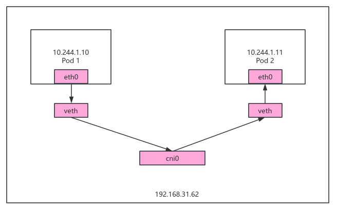
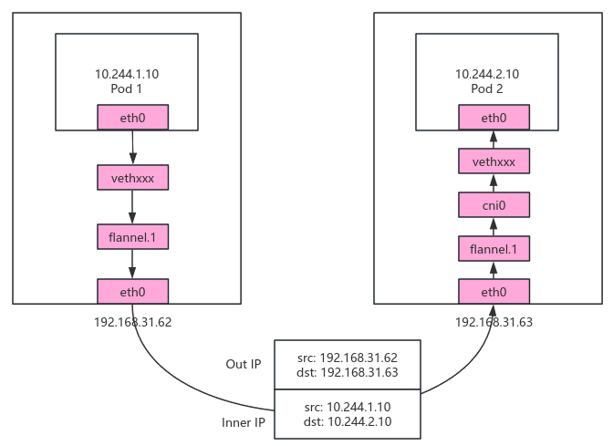
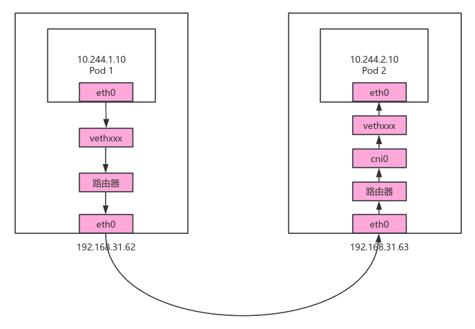

## Flannel概述

Flannel是CoreOS维护的一个网络组件，Flannel为每个Pod提供全局唯一的IP，Flannel使用ETCD来存储Pod子网与NodeIP之间的关系。Flannel守护进程在每台主机上运行，并负责维护ETCD信息和路由数据包。


## Flannel部署

### 默认配置部署

```shell
kubectl apply -f https://github.com/flannel-io/flannel/releases/latest/download/kube-flannel.yml
```


### 定制化部署

kubeadm部署时指定Pod网段:

```shell
kubeadm init --pod-network-cidr=10.244.0.0/16
```

指定controller-manager中配置：

```shell
cat /opt/kubernetes/cfg/kube-controller-manager.conf
--allocate-node-cidrs=true \    # 允许node自动分配网络
--cluster-cidr=10.244.0.0/16 \  # 指定Pod网络网段，需要与Flannel网段对应
```

Flannel配置文件中配置Flannel网段：

```shell
# kube-flannel.yml
net-conf.json: |
    {
      "Network": "10.244.0.0/16",    # Flannel网段
      "Backend": {
        "Type": "vxlan"    # 工作模式
      }
    }
```

kubelet开启cni支持：

```shell
# /opt/kubernetes/cfg/kubelet.conf
KUBELET_OPTS="--logtostderr=false \
--v=4 \
--log-dir=/opt/kubernetes/logs \
--network-plugin=cni \    # 开启cni支持
...
"
```


## Flannel工作模式及原理

### Flannel网络模型

Flannel会为每个节点分配一个独立的子网(Pod CIDR)如10.244.1.0/24，节点上的所有Pod从该子网获取IP。

Flannel支持多种数据转发方式：

- UDP：最早支持的一种方式。由于性能最差，目前已经弃用。
- VXLAN（默认方式）：Overlay Network方案，源数据包封装在另一种网络包里面进行路由转发和通信。
- Host-GW：Flannel通过在各个节点上的Agent进程，将容器网络的路由信息刷到主机的路由表上，这样一来所有的主机都有整个容器网络的路由数据了。


### 同一节点内Pod通信流程

特点：全程无封包/解包，不经过Flannel的Overlay（如VXLAN），延迟极低(等同主机内进程通信)。



通信步骤：

1）Pod 1发起请求

数据包从Pod 1的eth0发出，源IP：10.244.1.10，目的IP：10.244.1.11。

2）数据包到达主机网格栈

pod和缩主机网络通过veth pair组件连接，实现跨网络命名空间通信。Pod的eth0是veth pair的一端，另一端在主机命名空间(vethxxxx)。

pod 1的eth0对端是主机的vethxxxx，数据包通过此虚拟设备进入主机内核协议栈。

主机路由表(ip route show)  包含了Flannel添加的路由规则：

```shell
# ip route show | grep cni0
10.244.1.0/24 dev cni0 proto kernel scope link src 10.244.1.10
```

目标IP匹配了该路由，数据包被转发到cni0网桥。

3）通过cni0网桥直达pod 2

cni0是节点上所有pod的共享网桥，维护MAC地址表。

数据包通过网桥直接转发到Pod 2对应的Vethxxxx(无需ARP查询，因MAC地址已学习)。

4）数据包进入pod 2的eth0

通过vethxxxx进入pod 2的eth0，完成通信。


验证命令：

```shell
# 查看网桥连接的veth
brctl show cni0

# 查看具体的veth对
ip link show vethxxxx
```


### 跨节点Pod通信流程（VXLAN模式）

 

通信步骤：

1）Pod 1发起请求

数据包从Pod 1的eth0发出(源IP：10.244.1.10，目标IP：10.244.2.10)，通过veth pair进入节点的主机网络栈。

2）节点1内核路由表匹配

节点通过目标IP(10.244.2.10)匹配路由，数据包被转发到flannel.1设备。

```shell
# ip route show
10.244.0.0/16 via 10.244.0.0 dev flannel.1
```

3）ARP解析

节点1查询flannel.1的ARP表，获取目标Pod所在节点2的flannel.1设备的MAC地址。通过节点1查询FDB表可查询节点2 Fannel.1 MAC地址对应节点IP。Flannel通过Kubernetes API或etcd维护节点间的ARP和FDB（Forwarding Database）表。

查看节点flannel.1的ARP表和FDB：

```shell
# 查看ARP表
[root@localhost ~]# ip neigh show dev flannel.1
10.244.1.0 lladdr ca:2a:a4:59:b6:55 PERMANENT
10.244.2.0 lladdr d2:d0:1b:a7:a9:cd PERMANENT

# 查看fdb表
[root@localhost ~]# bridge fdb show  dev flannel.1
d2:d0:1b:a7:a9:cd dst 192.168.31.61 self permanent
ca:2a:a4:59:b6:55 dst 192.168.31.63 self permanent
```

4）VXLAN封装

封装外层报文(外层源IP：192.168.31.62，外层目标IP：192.168.31.63，VXLAN Header：VNI（VXLAN Network Identifier, 默认为1）标识Flannel网络)，内层仍为pod 1至pod 2的IP报文。

5）通过物理网络传输

封装后的UDP报文（默认端口8472）通过节点1的物理网卡（如eth0）发出，经过底层网络（如交换机、路由器）到达节点2。

6）节点2解封装

节点2的eth0收到UDP报文(目标端口8472)，内核识别VXLAN报文（根据VNI标识），剥离外层IP/UDP头，根据VNI将内层数据包交给flannel.1。

VXLAN封包/解封包是由VTEP设备处理的。

7）路由到目标Pod 2

节点2根据路由表将数据包导向cni0网桥。

```shell
# ip route show | grep cni0
10.244.2.0/24 dev cni0 proto kernel scope link src 10.244.2.1
```

通过cni0和veth pair将数据包转发到Pod 2的eth0。


### 跨节点Pod通信流程(Host-GW模式)

Flannel的host-gw模式是一种高性能的Kubernetes网络插件工作模式，它通过主机的路由表直接转发跨节点Pod的流量，无需封装(如VXLAN或IPIP)，原理类似于静态路由配置。

优点：

- 高性能：由于不涉及封包和解包，性能损失很小。
- 简单实现：直接通过路由表进行数据转发，无需隧道技术。

缺点：

- 网络要求高：宿主机之间必须二层网络连通，要求集群所有节点处于同一网络中。
- 路由表复杂：在大规模集群中，路由表的动态更新存在一定压力。



通信步骤：

1）Pod 1发起请求

数据包从Pod 1的eth0发出(源IP：10.244.1.10，目标IP：10.244.2.10)，通过veth pair进入节点的主机网络栈。

2）节点1内核路由表匹配

节点1根据路由表匹配到10.244.1.0/24的下一跳是192.168.31.63(节点2)。

3）通过物理网络传输

节点1通过物理网络(如eth0)直接将流量发给节点B。

4）节点2内核路由表匹配

节点B收到流量后，根据本地路由表将流量转发到cni0，继而转发至Pod 2。


### VXLAN与Host-GW模式对比

| 特性         | VXLAN            | Host-GW              |
| ------------ | ---------------- | -------------------- |
| 跨VLAN支持   | 支持             | 不支持(需一二层网络) |
| 性能         | 较低(封装开销)   | 高(直接路由)         |
| 配置复杂度   | 低(自动隧道)     | 中(需路由可达)       |
| 底层网络要求 | 仅需UDP 8472端口 | 需节点间二层互通     |
| 适用场景     | 云环境、跨子网   | 裸机、同机房集群     |


参考

- [Flannel网络分析](https://bbs.huaweicloud.com/blogs/432292)
