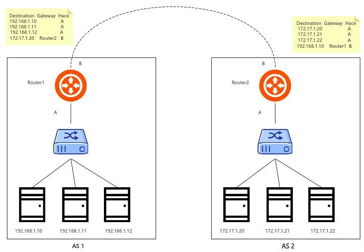
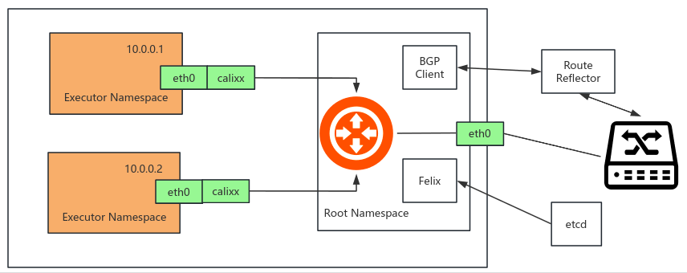
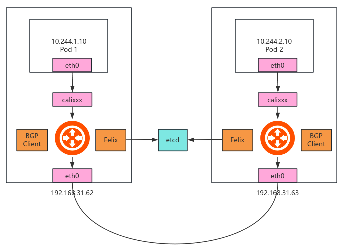
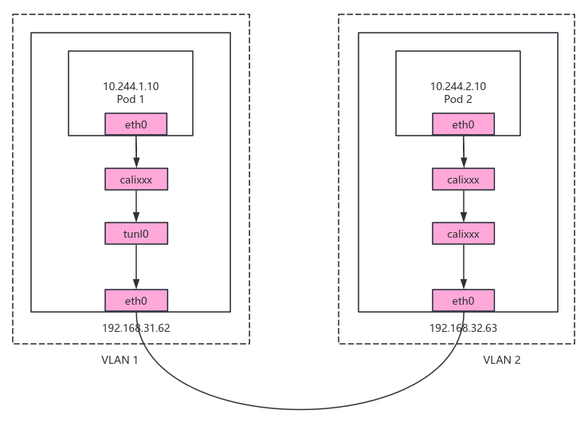

## Calico概述

Calico是一个纯三层的数据中心网络方案，Calico支持广泛的平台，包括Kubernetes、OpenStack等。

Calico在每一个计算节点利用Linux Kernel实现了一个高效的虚拟路由器(yRouter)来负责数据转发，而每个yRouter通过BGP协议负责把自己运行的workload的路由信息向整个Calico网络内传播。

此外，Calico项目还实现了Kubernetes网络策略，提供ACL功能。

## BGP概述

实际上，Calico项目提供的网络解决方案，与Flannel的host-gw模式几乎一样。也就是说，Calico也是基于路由表实现容器数据包转发，但不同于Flannel使用Flannel进程来维护路由信息的做法，Calico项目使用BGP协议来自动维护整个集群的路由信息。

BGP英文全称是Border Gateway Protocol，即边界网关协议，它是一种自治系统间的动态路由发现协议，与其他BGP系统交换网络可达信息。

为了能让你更清楚理解BGP，举个例子：

在这个图中，有两个自治系统(autonomous system，简称为AS)：AS 1和AS 2。

在互联网中，一个自治系统(AS)是一个有权自主决定在本系统中应用何种路由协议的小型单位。这个网络单位可以是一个简单的网络，也可以是一个由一个或多个普通的网络管理员来控制的网络群体，它是一个单独的可管理的网络单元(例如一所大学，一个企业或者一个公司个体)。一个自治系统有时也被称为一个路由选择域(routing domain)。一个自治系统将会分配一个全局的唯一的16位号码，有时我们把这个号码叫做自治系统号(ASN)。

在正常情况下，自治系统之间不会有任何来往。如果两个自治系统里的主机要通过IP地址直接进行通信。我们就必须使用路由器把这两个自治系统连接起来，BGP协议就是让他们互联的一种方式。

## Calico BGP模式

### Calico BGP实现

Calico主要由三部分组成：

- Felix：以DaemonSet方式部署，运行在每一个Node节点上，主要负责维护宿主机上路由规则以及ACL实现。
- BGP Client(BIRD)：主要负责把Felix写入Kernel的路由信息分发到集群Calico网络。
- Etcd：分布式键值存储，保存Calico的策略和网络配置状态。
- calicoctl：允许你从简单的命令行界面实现高级策略和网络。

### Calico BGP原理

Pod 1访问Pod 2大致流程如下：

- 数据包从容器1出，到达Veth Pair另一端(宿主机上，以cali前缀开头)。
- 宿主机根据路由规则，将数据包转发给下一跳(网关)。
- 到达Node 2，根据路由规则将数据包转发给cali设备，从而到达容器2。

其中，这里最核心的“下一跳”路由规则，就是由Calico的Felix进程负责维护的，这些路由规则信息，则是通过BGP Client也就是BIRD组件，使用BGP协议传输而来的。

不难发现，Calico项目实际上将集群里的所有节点，都当作是连边界路由器来处理，它们一起组成了一个全连通的网络，互相之间通过BGP协议交换路由规则，这些节点，我们称为BGP Peer。

## Calico IPIP模式

### IPIP原理

Pod 1访问Pod 2大致流程如下：

- 数据包从容器1出，到达Veth Pair另一端(宿主机上，以cali前缀开头)。
- 进入IP隧道设备（tunl0），由Linux内核IPIP驱动封装在宿主机网络的IP包中（新的IP包目的地址是原IP包的下一跳地址，即192.168.32.63），这样就成Node1到Node2的数据包。
- 数据包经过路由器三层转发到Node2。
- Node2收到数据包后，网络协议栈会使用IPIP驱动进行解包，从中拿到原的IP包。
- 然后根据路由规则，根据路由规则将数据包转发给cali设备，从而到达容器2。

不难看到，当Calico使用IPIP模式的时候，集群的网络性能会因为额外的封包和解包工作而下降，所以建议你将所有宿主机节点放在一个子网里，避免使用IPIP。
