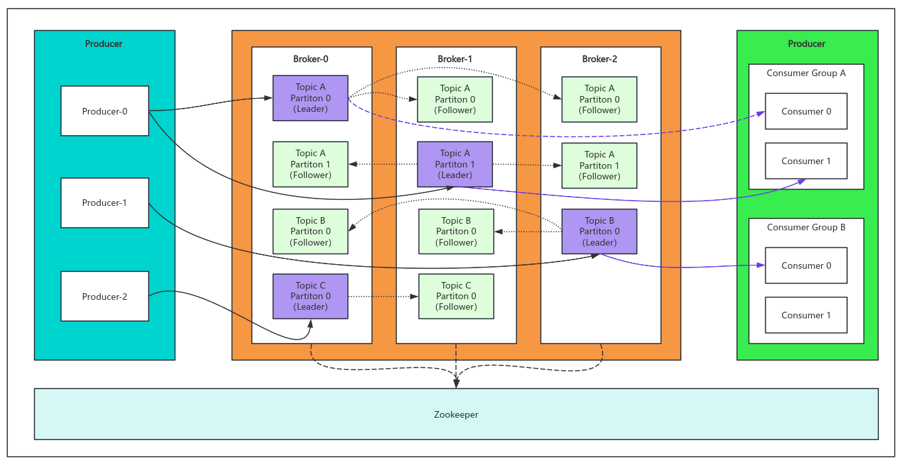

## Kafka概念

Kafka是最初由Linkedin公司开发，是一个分布式、支持分区（partition）的、多副本（replica）和基于zookeeper协调的分布式消息系统。它的最大的特性就是可以**实时**的处理大量数据以满足各种需求场景比如基于hadoop的批处理系统、低延迟的实时系统、storm/Spark流式处理引擎、web/nginx日志、访问日志和消息服务等等。用scala语言编写，Linkedin于2010年贡献给了Apache基金会并成为顶级开源项目。

### 产生背景

当今社会各种应用系统诸如商业、社交、搜索、浏览等像信息工厂一样不断的生产出各种信息，在大数据时代，我们面临如下几个挑战：

- 如何收集这些巨大的信息
- 如何分析它
- 如何及时做到如上两点

以上几种挑战形成了一个业务需求模型，即生产者生产（produce）各种信息，消费者消费（consume）（处理分析）这些信息，而在生产者与消费者之间，需要一个沟通两者的桥梁——消息系统。从一个微观层面来说，这种需求也可理解为不同的系统之间如何传递消息。

kafka即是解决上述这类问题的一个框架，它实现了生产者和消费者之间的无缝连接。

### Kafka特性

- 高吞吐量、低延迟：kafka每秒可以处理几十万条消息，它的延迟最低只有几这毫秒。
- 可扩展性：kafka集群支持热扩展。
- 持久性、可靠性：消息被持久化到本地磁盘，并且支持数据备份防止数据丢失。
- 容错性：允许集群中节点失败（若副本数量为n，则允许n-1节点失败）。
- 高并发：支持数千个客户端同时读写。

### Kafka场景应用

- 日志收集：可以用kafka收集各种服务的log，通过kafka以统一接口服务的方式开放给各种消费者，例如hadoop、Hbase、Solr等。
- 消息系统：解耦生产者和消费者和缓存消息等。
- 用户活动跟踪：kafka经常被用来记录web用户或者app用户的各种活动，如浏览网页、搜索、点击等活动，这些活动信息被各个服务器发布到kafka的topic中，然后订阅者通过订阅这些topic来做实时的监控分析，或者装载到hadoop、数据仓库中做离线分析和挖掘。
- 运营指标：kafka也经常用来记录运营监控数据。包括收集各种分布式应用的数据，生产各种操作的集中反馈，比如报警和报告。
- 流式处理：比如spark streaming和storm
- 事件源

### Kafka重要设计思想

- Consumergroup：各个consumer可以组成一个组，每个消息只能被组中的一个Consumer消费，如果一个消息可以被多个Consumer消费的话，那么这些Consumer必须在不同的组。
- 消息状态：在kafka中，消息的状态被保存在Consumer中，broker不会关心哪个消息被消费了，被谁消费了，只记录一个offset值（指向partition中下一个要被消费的消息位置），这就意味着如果Consumer处理不好的话，broker上的一个消息可能会被消费多次。
- 消息持久化：kafka中会把消息持久化到本地文件系统中，并且保持极高的效率。
- 消息有效期：kafka会长久保留其中的消息，以便Consumer可以多次消费，当然其中很多细节是可配置的。
- 批量发送：kafka支持以消息集合为单位进行批量发送，以提高push效率。
- push-and-pull：kafka中的Producer和Consumer采用的是push-and-pull模式，即Producer只管向broker push消息，Consumer只管从broker pull消息，两者对消息的生产和消费是异步的。
- kafka集群中的broker之间的关系：不是主从关系，各个broker在集群中地位一样，我们可以随意的增加或删除任何一个broker节点。
- 负载均衡方面：kafka提供了一个metadata API来管理broker之间的负载。
- 同步异步：Producer采用异步push方式，极大提高kafka系统的吞吐率（可以通过参数控制是采用同步还是异步方式）。
- 分区(partition)机制：kafka的broker端支持消息分区，Producer可以决定把消息发到哪个分区，在一个分区中消息的顺序就是Producer发送消息的顺序，一个主题中可以有多个分区，具体分区的数量是可以配置的。分区的意义很重大，后面的内容会逐渐体现。
- 离线数据装载：kafka由于对可拓展的数据持久化的支持，它也非常适合向hadoop或者数据仓库中进行数据装载。
- 插件支持：现在不少活跃的社区已经开发出不少插件来拓展kafka的功能，如用来配合storm、hadoop、flume相关的插件。

## Kafka架构原理

Kafka是一种高吞吐量的分布式发布订阅消息系统，它可以处理消费大规模的网站中的所有动作流数据，具有高性能、持久化、多副本备份、横向扩展能力。

### 基础架构

- Producer: 生产者，消息的产生者，是消息的入口。
- Broker：kafka实例，每个服务器上有一个或多个kafka的实例。
- Topic：消息的主题，可以理解为消息的分类，kafka的数据就保存在topic。在每个broker上都可以创建多个topic。
- Partition：Topic的分区，每个topic可以有多个分区，分区的作用是做负载，提高kafka的吞吐量。同一个topic在不同的分区的数据是不重复的，partition的表现形式就是一个一个的文件夹。
- Replication：每个分区都有多个副本，副本的作用是做备胎。当主分区（Leader）故障的时候会选择一个备胎（Follower）上位，成为Leader。Follower和Leader绝对是在不同的机器，同一机器对同一分区也只可能存放一个副本（包括自己）。
- Message：每一条发送的消息主体。
- Consumer：消费者，即消息的消费方，是消息的出口。
- Consumer Group：多个消费者组成一个消费者组，在kafka的设计中同一个分区的数据只能被消费者组中的某一个消费者消费。同一个消费者组的消费者可以消费同一topic的不同的分区的数据，这是为了提高kafka的吞吐量。
- Zookeeper：kafka集群依赖zookeeper来保存集群的元信息，来保证第系统的可用性。

### 工作流程分析

**发送流程**

发送流程具体如下：

- Producer先从集群获取分区的Leader。
- Producer将消息发送给Leader。
- Leader将消息写入本地文件。
- Follower从Leader pull消息。
- Followers将消息写入本地，然后向Leader发送ACK。
- Leader收到所有副本的ACK，然后向Producer发送ACK。

需要注意的是，Producer在写入数据的时候永远只找Leader，不会直接将数据写入Follower。Follower是**主动**找Leader同步数据的。

Producer采用push模式将数据发布到broker，每条消息追到分区中，顺序写入磁盘，所以保证同一分区内的数据是有序的。

上面说到数据会写入到不同的分区，那kafka为什么要做分区呢？

分区的主要目的是：

- 方便扩展：因为一个topic可以有多个partition，所以我们可以通过扩展机器去轻松的应对日益增长的数据量。
- 提高并发：以partition为读写单位，可以多个消费者同时消费数据，提高了消息的处理效率。

熟悉负载均衡的朋友应该知道，当我们向某个服务器发送请求的时候，服务端可能会对请求做一个负载，将流量分发到不同的服务器，那在kafka中，如果某个topic有多个partition，Producer又怎么知道该将数据发往哪个partition呢？

在kafka中有几个原则：

- partition在写入的时候可以指定需要写入的partition，如果有指定，则写入对应的partition。
- 如果没有指定partition，但是设置了数据的key，则会根据key的值hash出一个partition。
- 如果既没指定partition，又没有设置key，则会轮询选出一个partition。

